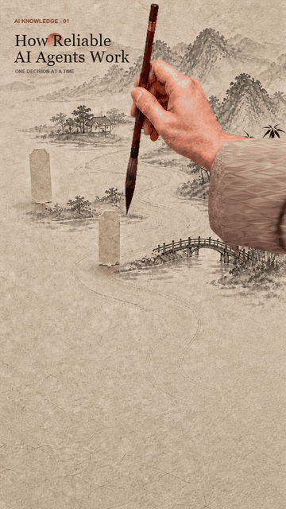

# InkBrush Motion｜水墨知識動畫 Skill

這是一個開源 AI Skill，把已確認的知識內容轉成原生 9:16 中國水墨／書法感動畫包。它刻意避開霓虹、漂浮卡片與科技粒子，改用宣紙、山水、留白、運筆與墨色擴散呈現 AI 知識。

<div align="center">
  <a href="https://vivi911.github.io/inkbrush-motion-skill/">
    
  </a>
</div>

[公開後觀看 HTML 動畫示範](https://vivi911.github.io/inkbrush-motion-skill/)｜[英文主 README](README.md)｜[Skill 規格](SKILL.md)

## 核心規則

- 先做 9:16 靜態稿，Vivi／使用者拍板後才做動態。
- 預覽 720×1280；正式規格 1080×1920、30fps、H.264。
- 正式文字必須是 SVG／程式字層，不相信生圖模型寫字。
- 筆尖必須走在墨跡最前方；墨色延遲擴散，不能用全畫面擦除假裝書寫。
- 真人手模式必須依序呈現懸筆、落筆、頓筆、行筆、轉鋒、提筆、回鋒、收筆、離紙九個動作；不能只移動一支浮空毛筆或固定手臂。
- 動態交付要附開頭／中段／結尾三張證據畫面。

## 一分鐘試玩

```bash
git clone https://github.com/vivi911/inkbrush-motion-skill.git
cd inkbrush-motion-skill
python3 -m http.server 8000
```

瀏覽器開啟 `http://localhost:8000`，按下 **Replay the brush**。

## 著作權

Copyright © 2026 Vivi（GoAskVivi）。

本 repo 的程式、Skill 指令、文件、SVG／CSS／JavaScript 視覺、已發布的社群預覽，以及經 Vivi 選定的 AI 輔助水墨底圖與九動作手筆素材，均在發布者可控制且依法可授權的範圍內採 [MIT License](LICENSE)。第三方工具與系統字體仍依各自授權。轉載或改作時需保留著作權與授權聲明。GoAskVivi 名稱與品牌識別不包含在背書授權內。

水墨底圖與九動作手筆素材由 OpenAI ImageGen 依人工美術指導產生；手是合成視覺素材，不冒充真實畫師的作品紀錄。精確文字與動畫由 HTML／SVG／CSS／JavaScript 控制。repo 沒有內嵌第三方開源程式碼。完整邊界見 [COPYRIGHT.md](COPYRIGHT.md)。

如果你也想讓 AI 知識回到安靜、手作、有人味的畫面，歡迎替 repo 按一顆 Star。
